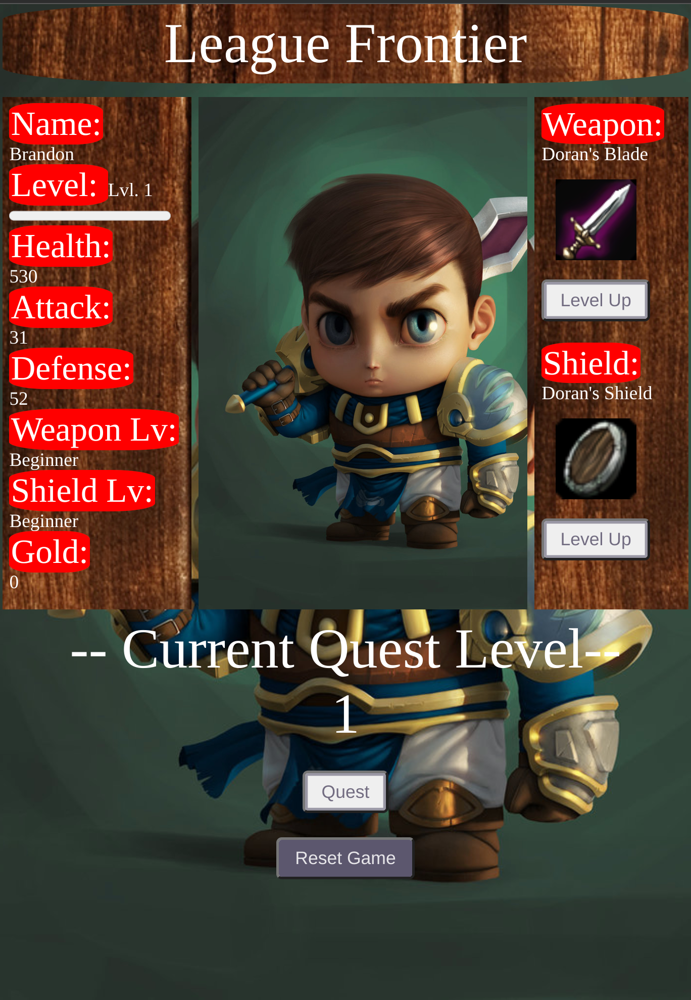

# web-game
## Final Spring Project for High School Web Dev Class

A simple html game created using html/css, javascript. Users can select a character at the beginning and start their journey. Upon selection, user will enter the main menu.

## User Interaction:

This game only involves clicking events, all actions can be done via mouse input.

## Accessing the Game:

Game can be access directly [here](https://xinyilin.me/web-game)

### Pre-requisite:

Git

### Download:

For download, users can download the repository via Git on their local machines. Then user can open the index.html file in their browser to access the game locally.

## Contribution:

Github Username: xlin6798
